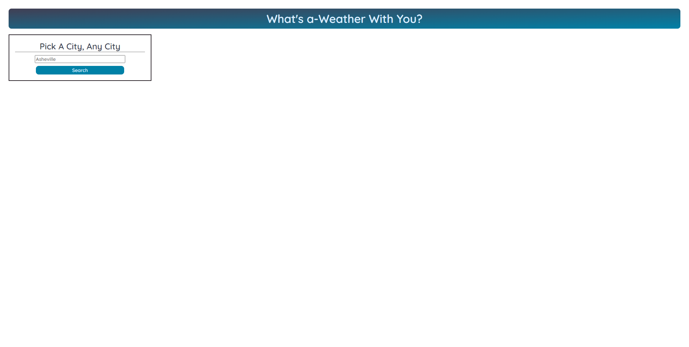
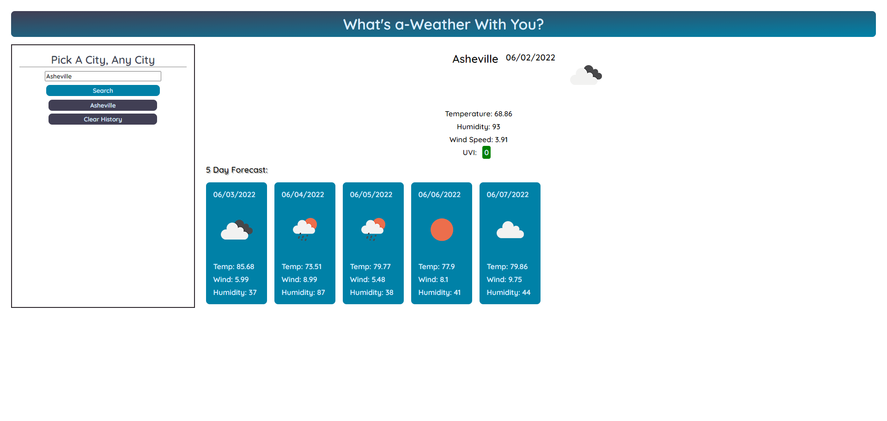

# Weather Dashboard

## Table of Contents

1. [Description](#description)
2. [Usage](#usage)
3. [Visuals](#visuals)
4. [Resources](#resources)

## Description

Created web page from scratch to display current and future weather conditions of a city by leveraging OpenWeather APIs.

Features include:

- ability to search for a city, invalid searches will be labelled not found
- displayed name of the city, current date, icon depicting weather, temperature, humidity, wind speed, and UVI
- displayed five day forecast of the next five days, with relevant dates, weather icon, temperatures, wind speed, and humidity
- UVI will be color coded based on level (mild - green, medium - orange, severe - red)
- previous searches will be saved to local storage for easy access and displayed on the side of the page
- local storage can be cleared with a button click

## Usage

User can enter a city name in the text area and click 'Search' to display the results. An invalid search will yield 'No Results Found'. A valid search will display current weather conditions and a five day forecast. The search will then be saved in local storage and displayed on the left side for easy re-searches. If desired, the local storage and search history display can be cleared by clicking 'Clear History'.

## Visuals
The page on first landing.

The page after a valid search is performed. HTML is dynamically updated.

## Resources
- [Live Site](https://kleylakb89.github.io/06-weather-dashboard/)
- [Repository](https://github.com/kleylakb89/06-weather-dashboard)